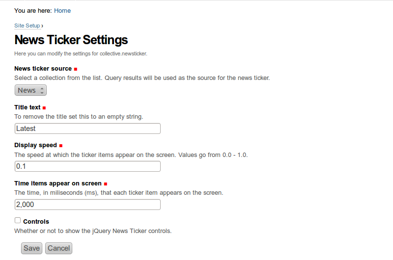
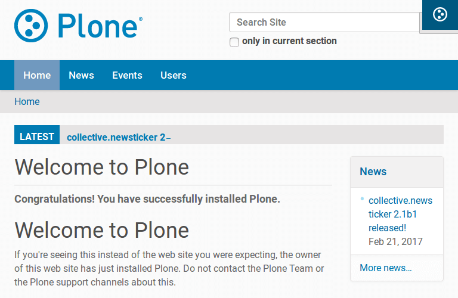

=====================
collective.newsticker
=====================

.. contents:: Table of Contents

Overview
--------

News ticker inspired by the one in `BBC News`_ website.

Requirements
------------

- `Plone`_ >= 4.1
- `five.grok`_ >= 1.2
- `zope.schema`_ >= 3.8.0

Features
--------

- jQuery-based, lightweight and easy to use news ticker.
- Fully configurable via configlet.

Use
---

- Open News Ticker Settings configlet on Plone's Site Setup.
- Select any collection from the ones available.

That's it! You will see the items included in the collection displayed, site
wide, on a news ticker. You can click on any item to open it.

Screenshots
-----------

.. _`BBC News`: http://www.bbc.co.uk/news/
.. _`five.grok`: http://pypi.python.org/pypi/five.grok
.. _`Plone`: http://pypi.python.org/pypi/Plone
.. _`zope.schema`: http://pypi.python.org/pypi/zope.schema

