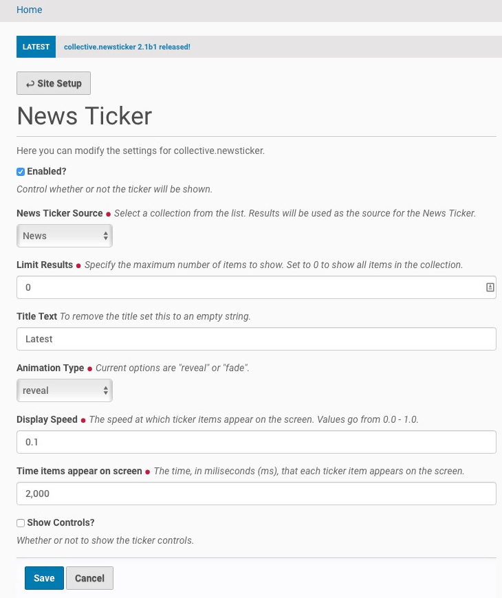

=====================
collective.newsticker
=====================

.. contents:: Table of Contents

Overview
--------

News ticker inspired by the one on the `BBC News`_ website.

Features
--------

- jQuery-based, lightweight and easy to use news ticker.
- Configurable via configlet.
- Users have full control on what items to display by using collections.

Use
---

- Open 'News Ticker Settings' configlet on Plone's 'Site Setup'.
- Select the collection containing the items you want to display.

That's it! You will see the items included in the collection on a site-wide
news ticker.

You can click on any item to open it.

Screenshots
-----------

    The configlet.

.. figure:: newsticker.png
    :align: center
    :height: 325px
    :width: 800px

    The news ticker in action.

.. _`BBC News`: http://www.bbc.co.uk/news/

